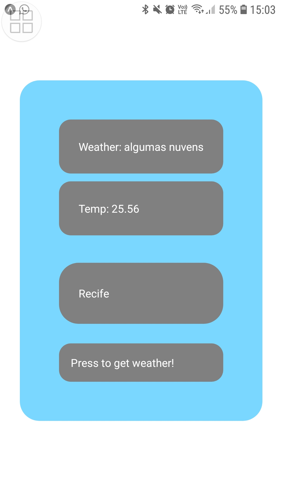

# APP That Consumes from Weather Api

Aplicação construida para consumir API: https://github.com/jhowbhz/weather-api

Para rodar a aplicação é necessário rodar <b>expo start --tunnel<b>
Então abra o aplicativo utilizando o aplicativo Expo Go que pode ser baixado na PlayStore. É necessário scannear o QR Code. <b>
  
